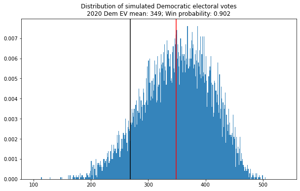
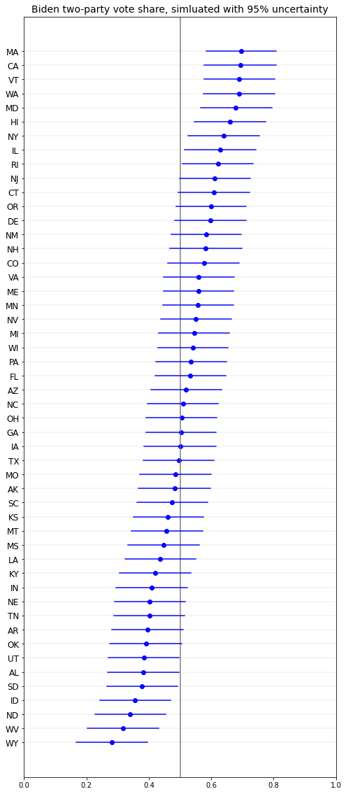
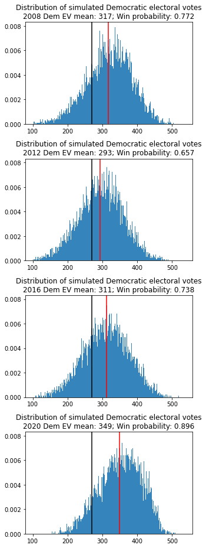

# election-sim

This is the code for an election simulation, based heavily on [Drew Linzer's](https://twitter.com/DrewLinzer/status/1293216061953736709) simple simulation. Right now it's just focusing on the presidency, but I hope to expand it over time to include other offices (House, Senate, Governors, State Legislatures).

Here are the initial results from the presidential simulation for 2020:

 

And here's the simulated Democratic voteshare by state:

 

And the model backtested against the 2008-2016 elections:

 

